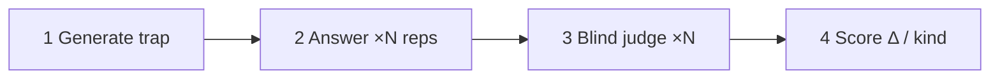

# A/B Blind-Judge Protocol (portable core)

> Language-agnostic spec shared by `ab-x3.js` (Claude Code), `scripts/ab_harness.py`
> (Anthropic API), and manual agent loops. **Scoring must match**
> [`python/protocol.py`](python/protocol.py) — unit-tested golden vectors from round6.

## Purpose

Measure whether a skill **rescues a weak MT** on its documented #1 trap — not whether a
frontier model already knows the answer.

## Tiers (see [`../ANTI-BIAS-PROTOCOL.md`](../ANTI-BIAS-PROTOCOL.md))

| Tier | Who runs it | Promote `semi-stable`? |
|---|---|---|
| **`full`** | Weak answerer (Haiku) + strong blind judge (Opus), order swapped | ✅ |
| **`manual`** | Same session / same model answers and judges | ❌ exploratory only |
| **`screen`** | Light screen row in `_ab_slim` | ❌ use round4/5 markdown |

Adapters: [`adapters/claude-code.md`](adapters/claude-code.md) ·
[`adapters/cursor.md`](adapters/cursor.md) · [`adapters/codex.md`](adapters/codex.md)

## Phases (per skill)



### 1 — Generate (strong model)

Read the skill file. Derive **one** realistic Thai MT scenario that baits the documented trap
(`focus`). Do not reveal the correct answer. ≤120 words.

Template: [`prompts/generate.txt`](prompts/generate.txt)  
Placeholders: `{file}`, `{focus}` (+ skill body inlined by Python driver)

### 2 — Answer (weak model, ×N reps per arm)

For each rep `r` in `0 … N-1`:

- **Without skill:** fresh MT graduate, no special manual — answer ≤150 words.
- **With skill:** same persona, skill body available inline — answer ≤150 words.

Templates: [`prompts/answer_base.txt`](prompts/answer_base.txt),
[`prompts/answer_with_skill.txt`](prompts/answer_with_skill.txt)

Run without/with **in parallel** per rep when the adapter supports it.

### 3 — Blind judge (strong model, separate from answerer)

For each rep, swap presentation order by `(target_index + rep) % 2`:

- **Even:** Answer 1 = without, Answer 2 = with  
- **Odd:** Answer 1 = with, Answer 2 = without  

Judge scores each answer 0–5 on trap-avoidance + safety (not prose polish).  
Template: [`prompts/judge.txt`](prompts/judge.txt)

Unswap scores back to `with_score` / `without_score` before aggregation.

### 4 — Aggregate & classify

Per skill, over N successful reps:

```
meanWith    = mean(with_score)
meanWithout = mean(without_score)
Δ           = meanWith − meanWithout
SE(Δ)       = √(sd(with)²/n + sd(without)²/n)   # sample SD, floored n−1
threshold   = max(2·SE(Δ), 0.8)
σ           = Δ / SE(Δ)  (if SE > 0)
```

**Kind** (act only on averaged Δ):

| kind | rule |
|---|---|
| `rescued` | Δ ≥ threshold **and** meanWithout ≤ 2.5 **and** meanWith ≥ 3 |
| `better` | Δ ≥ threshold |
| `regression` | Δ ≤ −threshold **and** meanWith ≤ 2.5 |
| `style-cost` | Δ ≤ −max(SE, 0.5) |
| `no-rescue` | both arms mean ≤ 2.5 |
| `tie` | otherwise |

**Reps:** N=3 screen · N=5 before promote/cut/rewrite · never act on a single pass.

## Config format

```json
{
  "targets": [
    {
      "skill": "foo-judgment",
      "file": "skills/foo-judgment.md",
      "focus": "the skill's own #1 anti-pattern"
    }
  ],
  "reps": 3
}
```

Also accepts a bare array of targets (default `reps: 3`) — same as `ab-x3.js` `parseConfig`.

## Output

Harness returns rows:

```json
{
  "skill": "foo-judgment",
  "reps": 3,
  "meanWithout": 2.0,
  "meanWith": 4.5,
  "delta": 2.5,
  "se": 0.82,
  "sigma": 3.05,
  "threshold": 1.64,
  "kind": "rescued"
}
```

Append to `eval/_ab_slim.json` with `"tier": "full"`, `"method": "x3"` or `"x5"`,
`"run": "<id>"`. Use `python/scripts/ab_harness.py --append-slim` or
[`python/append_slim.py`](python/append_slim.py).

Checkpoints: `eval/runs/<timestamp>/results.json` (SCALE-PLAN pattern).

## References

- Method: [`../METHOD.md`](../METHOD.md) Layer 2  
- Gate: [`../AB-GATE.md`](../AB-GATE.md)  
- Anti-bias: [`../ANTI-BIAS-PROTOCOL.md`](../ANTI-BIAS-PROTOCOL.md)
