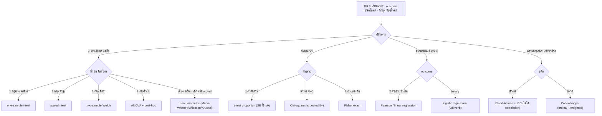

# เลือกสถิติทดสอบให้ถูก

มีข้อมูล + คำถามวิจัย แต่ไม่รู้ใช้ test ไหน → ตอบ 3 คำถาม แล้วได้ test ที่ใช่ **พร้อมเหตุผลและเงื่อนไขที่ต้องเช็ค**

> **กฎเหล็ก #1: ถามก่อนเสมอว่า "ข้อมูลจับคู่ (paired) หรืออิสระ?"** — ถ้าวัดซ้ำหน่วยเดิม (ก่อน-หลัง, คนเดียวกัน 2 วิธี, ตัวอย่างเดียวกัน) = **paired/correlated** ต้องจับคู่ (paired t / Wilcoxon / McNemar) **ห้าม**ใช้ test แบบ 2 กลุ่มอิสระ.
> **กับดักที่ reviewer ตีกลับบ่อยสุด** ไม่ใช่ "คำนวณผิด" แต่คือ **"เลือก test ผิดตั้งแต่ต้น"** — เอา test อิสระไปจับข้อมูลจับคู่, เอา correlation ไปวัด agreement, ลืมเช็ค expected count.
> 🔑 **Discriminator ตัวพราง:** "คนละคน/คนละกลุ่ม" ≠ อิสระเสมอ — ถ้า **match กันเป็นคู่** (เคส-คอนโทรลจับคู่อายุ-เพศ, ฝาแฝด, ก่อน-หลังในหน่วยเดียว) ก็ยังเป็น paired. ตัดสินที่ **"มีการจับคู่ระหว่างหน่วยสังเกตไหม"** ไม่ใช่ "คนเดียวกันหรือเปล่า"

## ใช้เมื่อ
- มีข้อมูล R2R/วิจัยแล้ว แต่ไม่แน่ใจว่าใช้สถิติตัวไหน
- reviewer/อาจารย์ถามว่า "ทำไมใช้ test นี้" แล้วตอบไม่ได้
- จะออกแบบงานวิจัย อยากรู้ล่วงหน้าว่าจะวิเคราะห์ด้วยอะไร (จะได้เก็บข้อมูลให้ถูก)

## วิธีใช้
วาง skill นี้ + เล่า *"คำถามวิจัยคือ... ข้อมูลที่มีคือ... อยากเปรียบเทียบ/หาความสัมพันธ์ของ..."* → AI จะถาม 3 อย่างแล้วชี้ test + เงื่อนไข

---

## วิธีเลือก (AI: ทำตามนี้)

### ขั้น 1 — ถาม 3 คำถามก่อนเสมอ (อย่าเดา)
1. **เป้าหมายคืออะไร?** เปรียบเทียบกลุ่ม / หาความสัมพันธ์-ทำนาย / วัดความสอดคล้อง (agreement)
2. **outcome เป็นชนิดไหน?** ตัวเลข (numeric) / หมวด (categorical) / อันดับ (ordinal เช่น Likert, เกรด, +/++/+++)
3. **กี่กลุ่ม + จับคู่ไหม?** 1 / 2 / ≥3 กลุ่ม · **จับคู่/correlated** (วัดซ้ำหน่วยเดิม, ก่อน-หลัง, match เป็นคู่, สัดส่วน 2 ค่าจาก sample เดียว) หรือ **อิสระ** (คนละหน่วย ไม่มีการจับคู่)

> ⚠️ คำถาม 3 คือตัวชี้ขาด — **ถ้ายังไม่รู้ว่า paired หรืออิสระ ห้ามชี้ test.** ถ้าผู้ใช้ตอบไม่ครบ → ถามให้ครบก่อน อย่าเดาแทน

### ขั้น 2 — ใช้ decision tree

**A. เปรียบเทียบค่าเฉลี่ย (outcome = ตัวเลข)**
- 1 กลุ่ม เทียบค่าอ้างอิง → **one-sample t-test**
- 2 กลุ่ม **จับคู่** (ก่อน-หลัง, วัดซ้ำหน่วยเดียว) → **paired t-test** (ทำผลต่างก่อน)
- 2 กลุ่ม **อิสระ** → **two-sample t-test** — ใช้ **Welch เป็น default** (ไม่ต้องสมมติ variance เท่า ปลอดภัยกว่า)
- ≥3 กลุ่ม → **One-way ANOVA** + post-hoc (เช่น Tukey/LSD) ถ้า significant
- 2 ปัจจัย → **Two-way ANOVA** — ⚠️ **ดู interaction ก่อน**: ถ้า A×B significant ตีความ main effect เดี่ยวๆ ไม่ได้

**B. ถ้าไม่ normal / n เล็ก / ordinal → non-parametric** (digest ไม่เน้น แต่ข้อมูล lab เจอบ่อย)
- paired → **Wilcoxon signed-rank** · 2 กลุ่มอิสระ → **Mann-Whitney U** · ≥3 กลุ่ม → **Kruskal-Wallis**
- ความสัมพันธ์ที่ไม่เชิงเส้น/ordinal → **Spearman correlation** (แทน Pearson)

**C. สัดส่วน / ข้อมูลนับ (outcome = หมวด)**
- 1 หรือ 2 สัดส่วน **อิสระ** → **z-test for proportion** (⚠️ SE ใช้ **p₀** ของ null ไม่ใช่ p̂)
- 2 สัดส่วน **จับคู่** (วิธี/test 2 ตัวบนคนเดียวกัน, ก่อน-หลัง แบบ yes/no) → **McNemar's test** (z-test 2 สัดส่วนใช้ไม่ได้ — correlated)
- ตาราง R×C หาความสัมพันธ์ → **Chi-square independence** (⚠️ เกณฑ์ expected count: **2×2 ต้องทุก cell ≥5**; **R×C ใหญ่** ผ่อนได้ — ห้ามมี cell ใด <1 และ ≤20% ของ cell <5 ตามกฎ Cochran ไม่ใช่ "ทุก cell ≥5" แบบเหมารวม)
- 2×2 + cell เล็ก (expected <5) → **Fisher's exact test**

**D. ความสัมพันธ์ / ทำนาย**
- 2 ตัวแปรตัวเลข เชิงเส้น → **Pearson correlation / simple linear regression**
- outcome ตัวเลข + หลาย predictor → **multiple regression** (⚠️ เช็ค multicollinearity, VIF>5–10 = ปัญหา)
- outcome **แบบ 2 ค่า** (เป็น/ไม่เป็นโรค) → **logistic regression** (รายงานเป็น **OR = e^β**)

**E. ความสอดคล้อง / เทียบวิธีวัด (MT เจอบ่อยสุด)**
- 2 วิธีวัดค่าตัวเลข เครื่องเก่า/ใหม่ → **Bland-Altman + ICC** ❗**ไม่ใช่ correlation** (r สูงแต่ bias ได้)
- 2 ผู้อ่านตัดสินหมวด (เช่น อ่านสไลด์) → **Cohen's kappa** (ordinal → **weighted kappa**)

### ขั้น 3 — บอกเงื่อนไขที่ต้องเช็ค ไม่ใช่แค่ชื่อ test
ทุกครั้งที่ชี้ test ให้แนบ assumption ที่ต้องตรวจ เช่น t-test → independence + normality (ของ residual/ค่าเฉลี่ย ไม่ใช่ data ดิบ); n เล็ก+skew → ย้าย non-parametric

### ขั้น 4 — เตือนกับดักที่เข้ากับเคสนั้น
ดึงข้อที่เกี่ยวจาก "กับดัก" ด้านล่างมาเตือน (เช่น ถ้าเป็น 2 % จาก sample เดียวกัน → เตือนว่า correlated)

---

## กับดัก (Anti-patterns)
- **จับคู่แต่ใช้ two-sample** — ข้อมูลก่อน-หลังคนเดียวกันต้องทำผลต่าง (paired) ไม่งั้นเสีย power
- **เอา correlation ไปสรุป agreement** — method comparison ต้อง ICC/Bland-Altman; r สูงไม่ได้แปลว่าตรงกัน
- **2 สัดส่วนจาก sample เดียวกัน** (เช่น %เห็นด้วย A vs B ในคนกลุ่มเดียว) = correlated → ใช้ **McNemar** ไม่ใช่ two-sample proportion
- **proportion test ใช้ p̂ ใน SE** — ที่ถูกคือใช้ **p₀** (ค่าจาก null hypothesis)
- **ปัด expected count** → 2×2 ทุก cell ต้อง ≥5 ไม่งั้นใช้ Fisher's exact; แต่ **R×C ใหญ่ห้ามเหมา** ว่าต้อง ≥5 ทุก cell — ผ่านได้ถ้า ≤20% ของ cell <5 และไม่มี cell <1
- **ทำ t-test ทุกคู่เมื่อมีหลายกลุ่ม** → Type I error สะสม ใช้ ANOVA + post-hoc แทน
- **ลืมเช็ค normality / ยัด t-test กับ ordinal** → n เล็ก/skew/Likert ใช้ non-parametric
- **พูดว่า "accept H₀"** → ที่ถูกคือ "fail to reject H₀"
- **two-way ANOVA แล้วตีความ main effect ทั้งที่ interaction significant**

---

## ช่องสำหรับผู้เชี่ยวชาญเติม
> เติม test ที่สายงานคุณใช้บ่อย + เคสที่เลือกผิดแล้วโดนตีกลับ เช่น:
> - *"งาน lab แบบ... ผมเลือก... เพราะข้อมูลมัน skew/ordinal"*
> - *"reviewer วารสาร... ชอบถามเรื่อง... ต้องเตรียม..."*
> - *"test ที่ตำราบอกใช้ได้ แต่ข้อมูลจริง n เล็ก ผมเลี่ยงไป..."*

---
*ช่วยชี้ว่าควรใช้ test ไหนเพื่อช่วยคิด — เป็นการชี้ทางเพื่อการศึกษา ไม่ใช่ที่ปรึกษาสถิติ ควรตรวจ assumption จริงและปรึกษานักสถิติเมื่อเป็นงานตีพิมพ์ ผู้นำไปใช้รับผิดชอบการตัดสินใจที่นำไปใช้จริง · ผู้สร้างไม่รับผิดต่อความเสียหายจากการนำไปใช้*
